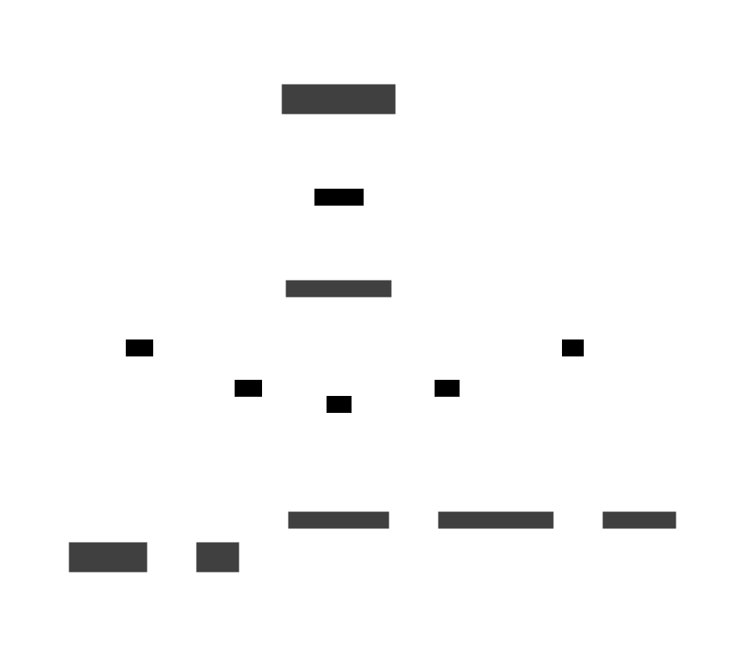

# [←](../README.md) | Campaign Service
A service that manages notification campaigns, user targeting, and campaign execution. Handles campaign creation, user segmentation, scheduling, and personalized notification delivery. Uses user data for targeting and personalization of campaign messages.

## Relationships

- **replies** Marketing Manager via http-server (http) — A marketing manager who is responsible for creating and managing campaigns.

- **uses** postgres via PostgreSQL — Uses PostgreSQL database
- **uses** redis via Redis — Uses Redis database
## Inter-Service Connections
- sends to Analytics Service via campaign.analytics
- sends to Notification Service via notification.user.{user_id}.push
- receives from User Service via user.info.request (reply)
- sends to User Service via user.info.request
## Message Flow

- publishes to Analytics Service (pub)
- publishes to Notification Service (pub)
- requests to User Service (req)
### Related Channels
- [campaign.analytics](../messageflow/channels/campaignanalytics.md)
- [notification.user.{user_id}.push](../messageflow/channels/notificationuseruser-idpush.md)
- [user.info.request](../messageflow/channels/userinforequest.md)
