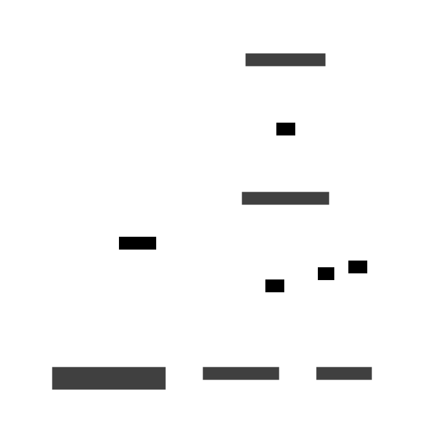
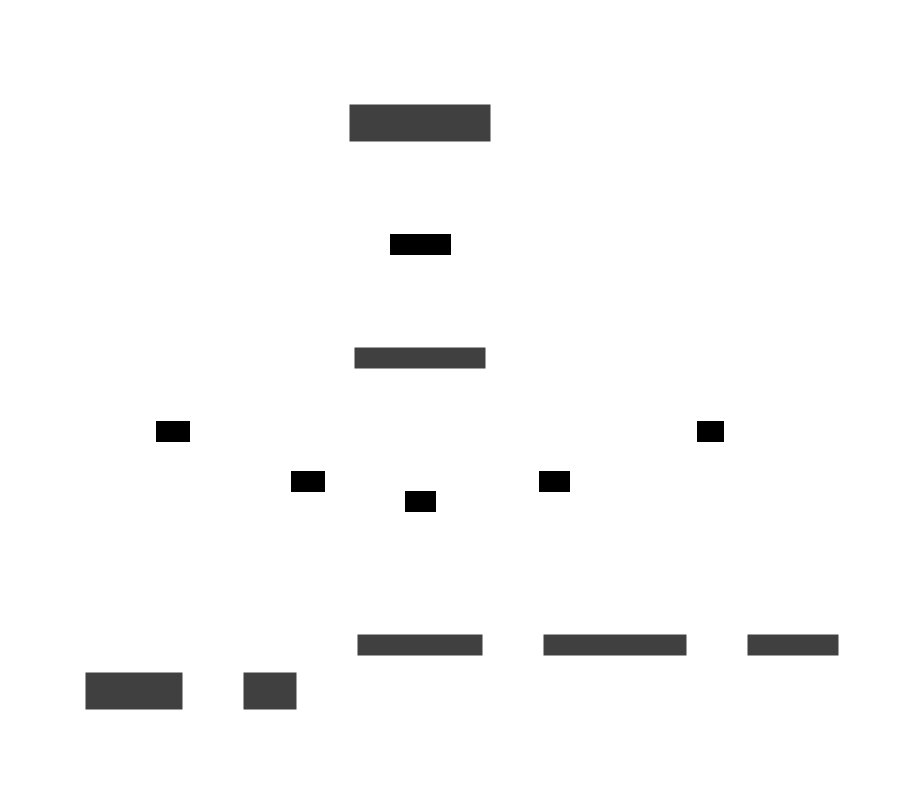

# HolyDOCs Test Documentation

## Table of Contents

- [Overview](#overview)
- [Services](#services)
  - [Analytics System](#analytics-system)
    - [Analytics Service](#analytics-service)
      - [Relationships](#analytics-service-relationships)
      - [Message Flow](#analytics-service-message-flow)
    - [Reports Service](#reports-service)
      - [Relationships](#reports-service-relationships)
      - [Message Flow](#reports-service-message-flow)
  - [Notification System](#notification-system)
    - [Mailer Service](#mailer-service)
      - [Relationships](#mailer-service-relationships)
      - [Message Flow](#mailer-service-message-flow)
    - [Notification Service](#notification-service)
      - [Relationships](#notification-service-relationships)
      - [Message Flow](#notification-service-message-flow)
  - [Standalone Services](#standalone-services)
    - [Campaign Service](#campaign-service)
      - [Relationships](#campaign-service-relationships)
      - [Message Flow](#campaign-service-message-flow)
    - [User Service](#user-service)
      - [Relationships](#user-service-relationships)
      - [Message Flow](#user-service-message-flow)
- [Message Flow](#message-flow)
  - [Context](#context)
  - [Channels](#channels)
    - [analytics.alert](#analyticsalert)
    - [analytics.insights](#analyticsinsights)
    - [analytics.report.request](#analyticsreportrequest)
    - [campaign.analytics](#campaignanalytics)
    - [campaign.create](#campaigncreate)
    - [campaign.execute](#campaignexecute)
    - [campaign.status](#campaignstatus)
    - [mailer.batch](#mailerbatch)
    - [mailer.send](#mailersend)
    - [notification.analytics](#notificationanalytics)
    - [notification.preferences.get](#notificationpreferencesget)
    - [notification.preferences.update](#notificationpreferencesupdate)
    - [notification.user.{user_id}.push](#notificationuseruser-idpush)
    - [reports.delivery](#reportsdelivery)
    - [reports.scheduled](#reportsscheduled)
    - [user.analytics](#useranalytics)
    - [user.info.request](#userinforequest)
    - [user.info.update](#userinfoupdate)

## Overview


### Design Principles
- **Event-driven architecture**: Services communicate through async message queues
- **Microservices with clear boundaries**: Each service has a single responsibility
- **Async communication**: All inter-service communication is asynchronous
- **Data-driven insights**: Analytics service provides real-time insights and reporting

### Technology Stack
- **Message Queues**: AsyncAPI for event-driven communication
- **Databases**: ClickHouse for analytics, PostgreSQL for transactional data
- **External Services**: SendGrid for email, Firebase for push notifications
- **Monitoring**: Built-in analytics and reporting capabilities


## Services
### Analytics System

#### Key Metrics Tracked

##### User Behavior
- User registration and login events
- Profile updates and preference changes
- Feature usage and engagement patterns

##### Notification Performance
- Delivery rates and success metrics
- Open and click-through rates
- User engagement with notifications

##### Campaign Effectiveness
- Campaign creation and execution metrics
- User response rates and conversions
- A/B testing results and performance

##### System Health
- Service performance and response times
- Error rates and system availability
- Resource utilization and capacity metrics
#### Analytics Service
A centralized analytics service that receives and processes analytics events from all other services. Provides insights, reporting, and analytics data aggregation for user behavior, notification performance, campaign effectiveness, and system-wide metrics.
- System: Analytics System

- Owner: team-data-science

- Repository: [https://github.com/holydocs/analytics-service](https://github.com/holydocs/analytics-service)

- Tags: analytics, data-science

<a id="analytics-service-relationships"></a>
##### Relationships


- **replies** Data Analyst via http-server (http) — A data analyst who is responsible for analyzing data and providing insights.

- **uses** clickhouse via ClickHouse — Uses ClickHouse database
##### Inter-Service Connections
- receives from Campaign Service via campaign.analytics
- receives from Notification Service via notification.analytics
- receives from Reports Service via analytics.report.request
- replies to Reports Service via analytics.report.request (reply)
- receives from User Service via user.analytics
<a id="analytics-service-message-flow"></a>
##### Message Flow

- receives from Campaign Service (pub)
- receives from Notification Service (pub)
- handles requests from Reports Service (req)
- receives from User Service (pub)
#### Reports Service
A service that generates and manages analytics reports by requesting data from the analytics service. Provides report scheduling, customization, and delivery capabilities for business intelligence and data-driven decision making.
- System: Analytics System

- Owner: team-data-science

- Repository: [https://github.com/holydocs/reports-service](https://github.com/holydocs/reports-service)

- Tags: analytics, business-intelligence, reporting

<a id="reports-service-relationships"></a>
##### Relationships


_No relationships documented._
##### Inter-Service Connections
- receives from Analytics Service via analytics.report.request (reply)
- sends to Analytics Service via analytics.report.request
<a id="reports-service-message-flow"></a>
##### Message Flow

- requests to Analytics Service (req)
### Notification System


#### Key Features
- **Multi-channel support**: Email, push notifications, SMS
- **User preferences**: Respects user notification preferences and quiet hours
- **Batch processing**: Efficient handling of large notification volumes
- **Real-time delivery**: Push notifications for immediate user engagement
- **Analytics integration**: Full tracking of notification performance and user engagement
#### Mailer Service
A service that handles email delivery through SendGrid. Receives email requests from other services and processes them for delivery. Supports various email types including transactional emails, notifications, and marketing campaigns.
- System: Notification System

- Owner: team-notifications

- Repository: [https://github.com/holydocs/mailer-service](https://github.com/holydocs/mailer-service)

- Tags: delivery, email, notifications, sendgrid

<a id="mailer-service-relationships"></a>
##### Relationships


- **requests** SendGrid via SendGrid _(external)_ — A cloud-based email infrastructure platform that helps businesses send and manage
large volumes of transactional and marketing emails.

<a id="mailer-service-message-flow"></a>
##### Message Flow

#### Notification Service
A service that handles user notifications, preferences, and interactions. Supports real-time notifications, user preferences management.
- System: Notification System

- Owner: team-notifications

- Repository: [https://github.com/holydocs/notification-service](https://github.com/holydocs/notification-service)

- Tags: notifications, preferences, real-time

<a id="notification-service-relationships"></a>
##### Relationships


- **requests** Firebase Cloud Messaging via FCM _(external)_ — A service from Google that enables developers to send notifications and
data messages to Android, iOS, and web apps

##### Inter-Service Connections
- sends to Analytics Service via notification.analytics
- receives from Campaign Service via notification.user.{user_id}.push
- receives from User Service via user.info.request (reply)
- receives from User Service via notification.preferences.update
- sends to User Service via user.info.request
<a id="notification-service-message-flow"></a>
##### Message Flow

- publishes to Analytics Service (pub)
- receives from Campaign Service (pub)
- receives from User Service (pub)
- requests to User Service (req)
### Standalone Services
#### Campaign Service
A service that manages notification campaigns, user targeting, and campaign execution. Handles campaign creation, user segmentation, scheduling, and personalized notification delivery. Uses user data for targeting and personalization of campaign messages.
<a id="campaign-service-relationships"></a>
##### Relationships


- **replies** Marketing Manager via http-server (http) — A marketing manager who is responsible for creating and managing campaigns.

- **uses** postgres via PostgreSQL — Uses PostgreSQL database
- **uses** redis via Redis — Uses Redis database
##### Inter-Service Connections
- sends to Analytics Service via campaign.analytics
- sends to Notification Service via notification.user.{user_id}.push
- receives from User Service via user.info.request (reply)
- sends to User Service via user.info.request
<a id="campaign-service-message-flow"></a>
##### Message Flow

- publishes to Analytics Service (pub)
- publishes to Notification Service (pub)
- requests to User Service (req)
#### User Service
A service that manages user information, profiles, and authentication. Handles user data requests, profile updates, and user lifecycle events.
<a id="user-service-relationships"></a>
##### Relationships


- **uses** elasticsearch via Elasticsearch — Uses Elasticsearch database
- **uses** postgres via PostgreSQL — Uses PostgreSQL database
##### Inter-Service Connections
- sends to Analytics Service via user.analytics
- receives from Campaign Service via user.info.request
- replies to Campaign Service via user.info.request (reply)
- receives from Notification Service via user.info.request
- replies to Notification Service via user.info.request (reply)
- sends to Notification Service via notification.preferences.update
<a id="user-service-message-flow"></a>
##### Message Flow

- publishes to Analytics Service (pub)
- handles requests from Campaign Service (req)
- handles requests from Notification Service (req)
- publishes to Notification Service (pub)

## Message Flow

### Context


### Channels
#### analytics.alert


##### Messages
**send**: AnalyticsAlertMessage
```json
{
  "actions": [
    "string"
  ],
  "affected_services": [
    "string[enum:user_service,notification_service,campaign_service]"
  ],
  "alert_id": "string[uuid]",
  "alert_type": "string[enum:anomaly_detected,threshold_exceeded,trend_change,system_issue]",
  "created_at": "string[date-time]",
  "current_value": "number",
  "description": "string",
  "metadata": {
    "environment": "string[enum:development,staging,production]",
    "platform": "string[enum:ios,android,web]",
    "source": "string[enum:mobile,web,api]",
    "version": "string"
  },
  "metric": "string",
  "severity": "string[enum:low,medium,high,critical]",
  "threshold": "number",
  "time_window": "string",
  "title": "string"
}
```
#### analytics.insights


##### Messages
**send**: AnalyticsInsightMessage
```json
{
  "category": "string[enum:user_behavior,notification_performance,campaign_effectiveness,system_health]",
  "confidence": "number[float]",
  "created_at": "string[date-time]",
  "data_points": [
    "object"
  ],
  "description": "string",
  "insight_id": "string[uuid]",
  "insight_type": "string[enum:trend,anomaly,recommendation,alert]",
  "metadata": {
    "environment": "string[enum:development,staging,production]",
    "platform": "string[enum:ios,android,web]",
    "source": "string[enum:mobile,web,api]",
    "version": "string"
  },
  "recommendations": [
    "string"
  ],
  "severity": "string[enum:low,medium,high,critical]",
  "title": "string"
}
```
#### analytics.report.request


##### Messages
**request**: AnalyticsReportRequestMessage
```json
{
  "created_at": "string[date-time]",
  "filters": {
    "campaign_ids": [
      "string[uuid]"
    ],
    "event_types": [
      "string"
    ],
    "user_ids": [
      "string[uuid]"
    ],
    "user_segments": [
      "string[enum:all_users,new_users,active_users,inactive_users,premium_users,free_users]"
    ]
  },
  "format": "string[enum:json,csv,pdf]",
  "metrics": [
    "string[enum:event_count,user_count,conversion_rate,engagement_rate,response_time,error_rate]"
  ],
  "report_id": "string[uuid]",
  "report_type": "string[enum:user_activity,notification_performance,campaign_effectiveness,system_health,custom]",
  "time_range": {
    "end": "string[date-time]",
    "granularity": "string[enum:minute,hour,day,week,month]",
    "start": "string[date-time]"
  }
}
```
**reply**: AnalyticsReportReplyMessage
```json
{
  "data": "object",
  "error": {
    "code": "string",
    "message": "string"
  },
  "generated_at": "string[date-time]",
  "insights": [
    {
      "confidence": "number[float]",
      "data_points": [
        "object"
      ],
      "description": "string",
      "impact": "string[enum:low,medium,high]",
      "title": "string",
      "type": "string[enum:trend,anomaly,correlation,recommendation]"
    }
  ],
  "report_id": "string[uuid]",
  "report_type": "string[enum:user_activity,notification_performance,campaign_effectiveness,system_health,custom]",
  "summary": {
    "event_types": "object",
    "top_metrics": {
      "conversion_rate": "number[float]",
      "engagement_rate": "number[float]",
      "error_rate": "number[float]",
      "response_time_avg": "number[float]"
    },
    "total_events": "integer",
    "unique_users": "integer"
  },
  "time_range": {
    "end": "string[date-time]",
    "granularity": "string[enum:minute,hour,day,week,month]",
    "start": "string[date-time]"
  }
}
```
#### campaign.analytics


##### Messages
**receive**: CampaignAnalyticsEventMessage
```json
{
  "campaign_id": "string[uuid]",
  "event_id": "string[uuid]",
  "event_type": "string[enum:campaign_created,campaign_executed,notification_sent,notification_opened,notification_clicked,campaign_completed,campaign_failed]",
  "execution_id": "string[uuid]",
  "metadata": {
    "environment": "string[enum:development,staging,production]",
    "platform": "string[enum:ios,android,web]",
    "source": "string[enum:mobile,web,api]",
    "version": "string"
  },
  "notification_id": "string[uuid]",
  "timestamp": "string[date-time]",
  "user_id": "string[uuid]"
}
```
#### campaign.create


##### Messages
**receive**: CampaignCreateMessage
```json
{
  "campaign_id": "string[uuid]",
  "created_at": "string[date-time]",
  "description": "string",
  "metadata": {
    "environment": "string[enum:development,staging,production]",
    "platform": "string[enum:ios,android,web]",
    "source": "string[enum:mobile,web,api]",
    "version": "string"
  },
  "name": "string",
  "notification_template": {
    "body_template": "string",
    "data": "object",
    "localization": "object",
    "priority": "string[enum:low,normal,high]",
    "title_template": "string"
  },
  "schedule": {
    "recurring": {
      "end_date": "string[date]",
      "frequency": "string[enum:daily,weekly,monthly]",
      "interval": "integer",
      "start_date": "string[date]"
    },
    "scheduled_at": "string[date-time]",
    "timezone": "string",
    "type": "string[enum:immediate,scheduled,recurring]"
  },
  "settings": {
    "a_b_testing": {
      "enabled": "boolean",
      "traffic_split": [
        "number"
      ],
      "variants": [
        {
          "body_template": "string",
          "data": "object",
          "localization": "object",
          "priority": "string[enum:low,normal,high]",
          "title_template": "string"
        }
      ]
    },
    "batch_size": "integer",
    "max_retries": "integer",
    "rate_limit": "integer",
    "respect_quiet_hours": "boolean"
  },
  "target_audience": {
    "estimated_reach": "integer",
    "user_filters": {
      "language": [
        "string"
      ],
      "last_activity": {
        "from": "string[date-time]",
        "to": "string[date-time]"
      },
      "registration_date": {
        "from": "string[date]",
        "to": "string[date]"
      },
      "timezone": [
        "string"
      ]
    },
    "user_segments": [
      "string[enum:all_users,new_users,active_users,inactive_users,premium_users,free_users]"
    ]
  }
}
```
#### campaign.execute


##### Messages
**receive**: CampaignExecuteMessage
```json
{
  "batch_size": "integer",
  "campaign_id": "string[uuid]",
  "created_at": "string[date-time]",
  "execution_id": "string[uuid]",
  "execution_type": "string[enum:immediate,scheduled,batch]",
  "metadata": {
    "environment": "string[enum:development,staging,production]",
    "platform": "string[enum:ios,android,web]",
    "source": "string[enum:mobile,web,api]",
    "version": "string"
  },
  "priority": "string[enum:low,normal,high]"
}
```
#### campaign.status


##### Messages
**send**: CampaignStatusUpdateMessage
```json
{
  "campaign_id": "string[uuid]",
  "error": {
    "code": "string",
    "message": "string"
  },
  "execution_id": "string[uuid]",
  "progress": {
    "failed": "integer",
    "sent": "integer",
    "success_rate": "number[float]",
    "total_targets": "integer"
  },
  "status": "string[enum:pending,running,completed,failed,paused,cancelled]",
  "updated_at": "string[date-time]"
}
```
#### mailer.batch


##### Messages
**receive**: BatchEmailRequestMessage
```json
{
  "batch_id": "string[uuid]",
  "batch_settings": {
    "delay_between_batches": "integer",
    "max_concurrent": "integer"
  },
  "emails": [
    {
      "content": {
        "html": "string",
        "text": "string"
      },
      "email_id": "string[uuid]",
      "from": {
        "email": "string[email]",
        "name": "string"
      },
      "priority": "string[enum:low,normal,high]",
      "scheduled_at": "string[date-time]",
      "subject": "string",
      "template_data": "object",
      "template_id": "string",
      "to": [
        {
          "email": "string[email]",
          "name": "string"
        }
      ]
    }
  ]
}
```
#### mailer.send


##### Messages
**receive**: EmailSendRequestMessage
```json
{
  "content": {
    "html": "string",
    "text": "string"
  },
  "email_id": "string[uuid]",
  "from": {
    "email": "string[email]",
    "name": "string"
  },
  "priority": "string[enum:low,normal,high]",
  "scheduled_at": "string[date-time]",
  "subject": "string",
  "template_data": "object",
  "template_id": "string",
  "to": [
    {
      "email": "string[email]",
      "name": "string"
    }
  ],
  "tracking": {
    "click_tracking": "boolean",
    "open_tracking": "boolean",
    "subscription_tracking": "boolean"
  }
}
```
#### notification.analytics


##### Messages
**receive**: NotificationAnalyticsEventMessage
```json
{
  "event_id": "string[uuid]",
  "event_type": "string[enum:notification_sent,notification_opened,notification_clicked]",
  "metadata": {
    "environment": "string[enum:development,staging,production]",
    "platform": "string[enum:ios,android,web]",
    "source": "string[enum:mobile,web,api]",
    "version": "string"
  },
  "notification_id": "string[uuid]",
  "timestamp": "string[date-time]",
  "user_id": "string[uuid]"
}
```
#### notification.preferences.get


##### Messages
**request**: PreferencesRequestMessage
```json
{
  "user_id": "string[uuid]"
}
```
**reply**: PreferencesReplyMessage
```json
{
  "preferences": {
    "categories": {
      "marketing": "boolean",
      "security": "boolean",
      "updates": "boolean"
    },
    "email_enabled": "boolean",
    "push_enabled": "boolean",
    "quiet_hours": {
      "enabled": "boolean",
      "end": "string[time]",
      "start": "string[time]"
    },
    "sms_enabled": "boolean"
  },
  "updated_at": "string[date-time]"
}
```
#### notification.preferences.update


##### Messages
**receive**: PreferencesUpdateMessage
```json
{
  "preferences": {
    "categories": {
      "marketing": "boolean",
      "security": "boolean",
      "updates": "boolean"
    },
    "email_enabled": "boolean",
    "push_enabled": "boolean",
    "quiet_hours": {
      "enabled": "boolean",
      "end": "string[time]",
      "start": "string[time]"
    },
    "sms_enabled": "boolean"
  },
  "updated_at": "string[date-time]",
  "user_id": "string[uuid]"
}
```
#### notification.user.{user_id}.push


##### Messages
**receive**: PushNotificationMessage
```json
{
  "body": "string",
  "created_at": "string[date-time]",
  "data": "object",
  "notification_id": "string[uuid]",
  "priority": "string[enum:low,normal,high]",
  "title": "string",
  "user_id": "string[uuid]"
}
```
#### reports.delivery


##### Messages
**send**: ReportDeliveryMessage
```json
{
  "attachment_url": "string[uri]",
  "delivered_at": "string[date-time]",
  "delivery_id": "string[uuid]",
  "delivery_method": "string[enum:email,webhook,s3,ftp]",
  "error_message": "string",
  "recipient": "string[email]",
  "report_id": "string[uuid]",
  "status": "string[enum:pending,sent,delivered,failed]"
}
```
#### reports.scheduled


##### Messages
**send**: ScheduledReportMessage
```json
{
  "next_run": "string[date-time]",
  "recipients": [
    "string[email]"
  ],
  "report_type": "string[enum:user_activity,notification_performance,campaign_effectiveness,system_health,custom]",
  "schedule": {
    "frequency": "string[enum:daily,weekly,monthly,quarterly,yearly]",
    "time": "string[time]",
    "timezone": "string"
  },
  "schedule_id": "string[uuid]"
}
```
#### user.analytics


##### Messages
**receive**: UserAnalyticsEventMessage
```json
{
  "event_id": "string[uuid]",
  "event_type": "string[enum:user_registered,user_logged_in,profile_updated,preferences_changed,account_deleted]",
  "metadata": {
    "environment": "string[enum:development,staging,production]",
    "platform": "string[enum:ios,android,web]",
    "source": "string[enum:mobile,web,api]",
    "version": "string"
  },
  "timestamp": "string[date-time]",
  "user_id": "string[uuid]"
}
```
#### user.info.request


##### Messages
**request**: UserInfoRequestMessage
```json
{
  "user_id": "string[uuid]"
}
```
**reply**: UserInfoReplyMessage
```json
{
  "email": "string[email]",
  "error": {
    "code": "string",
    "message": "string"
  },
  "language": "string",
  "name": "string",
  "timezone": "string",
  "user_id": "string[uuid]"
}
```
#### user.info.update


##### Messages
**send**: UserInfoUpdateMessage
```json
{
  "changes": "object",
  "metadata": {
    "environment": "string[enum:development,staging,production]",
    "platform": "string[enum:ios,android,web]",
    "source": "string[enum:mobile,web,api]",
    "version": "string"
  },
  "updated_at": "string[date-time]",
  "user_id": "string[uuid]"
}
```
